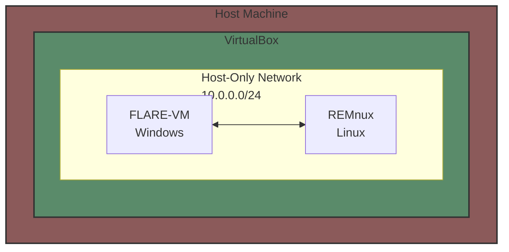

# Setting Up a Malware Analysis Lab

This guide will help you set up a secure environment for malware analysis using FLARE-VM (Windows) and REMnux (Linux) virtual machines.



## Prerequisites
- Download the appropriate version for your host operating system [VirtualBox](https://www.virtualbox.org/wiki/Downloads)
- Windows 10/11 Evaluation ISO from [Microsoft Eval Center](https://www.microsoft.com/en-us/evalcenter/)
- REMnux OVA from [REMnux Download Page](https://docs.remnux.org/install-distro/get-virtual-appliance)

## 1. Windows VM Setup (FLARE-VM)

### Initial Setup
1. Create a new Windows VM using the evaluation ISO
2. **IMPORTANT**: Take a snapshot after installation

### Security Configuration
1. **Disable Proxy Auto-Detection**
   - Open Windows Settings
   - Search for "proxy settings"
   - Turn off "Automatically detect settings"

2. **Disable Windows Defender**
   - Open Windows Security
   - Turn off all Defender settings
   - Disable Tamper Protection

3. **Configure Group Policy**
   - Open Group Policy Editor (gpedit.msc)
   - Navigate to: Administrative Templates → Windows Components → Microsoft Defender Antivirus
   - Enable "Turn off Microsoft Defender Antivirus"

4. **Disable Windows Firewall**
   - In Group Policy Editor:
     - Navigate to: Administrative Templates → Network → Network Connections → Windows Defender Firewall
     - Disable "Protect All Network Connections" for both Domain and Standard profiles

5. **Disable Windows Update**
   - In Group Policy Editor:
     - Navigate to: Administrative Templates → Windows Components → Windows Update
     - Enable "Configure Automatic Updates" and set it to "Disabled"

6. **Take another snapshot**

### Installing FLARE-VM
1. Open PowerShell as Administrator
2. Run the following commands:
```powershell
(New-Object net.webclient).DownloadFile('https://raw.githubusercontent.com/mandiant/flare-vm/main/install.ps1',"$([Environment]::GetFolderPath("Desktop"))\install.ps1")
cd $env:USERPROFILE\Desktop
Unblock-File .\install.ps1
Set-ExecutionPolicy Unrestricted
.\install.ps1
```
3. When the installation GUI appears, select the tools you want to install.
4. **Take a final snapshot**

> Cutter (GUI for radare2) is not selected by default in Flare-VM script.
{: .prompt-warning }

## 2. REMnux Setup

1. Import the downloaded REMnux OVA file into VirtualBox
2. Default credentials: remnux/malware
3. Update the system:
```bash
sudo apt update && sudo apt upgrade -y
```
4. Install all remnux tools
```bash
remnux upgrade
```

## 3. Network Configuration

### Create Host-Only Network in VirtualBox
1. Open VirtualBox → File → Preferences → Network
2. Add a new Host-Only Network with these settings:

**Adapter Settings:**
- IPv4 Address: 10.0.0.1
- IPv4 Network Mask: 255.255.255.0

**DHCP Server Settings:**
- Server Address: 10.0.0.2
- Server Mask: 255.255.255.0
- Lower Address Bound: 10.0.0.3
- Upper Address Bound: 10.0.0.254

### Configure both VMs to use this network adapter
1. For each VM (FLARE-VM and REMnux):
   - Right-click the VM in VirtualBox
   - Select "Settings"
   - Go to "Network" tab
   - Set Adaptater Type to  "Host-only Adapter"
   - Select the host-only network we created earlier
   - Click "OK" to save