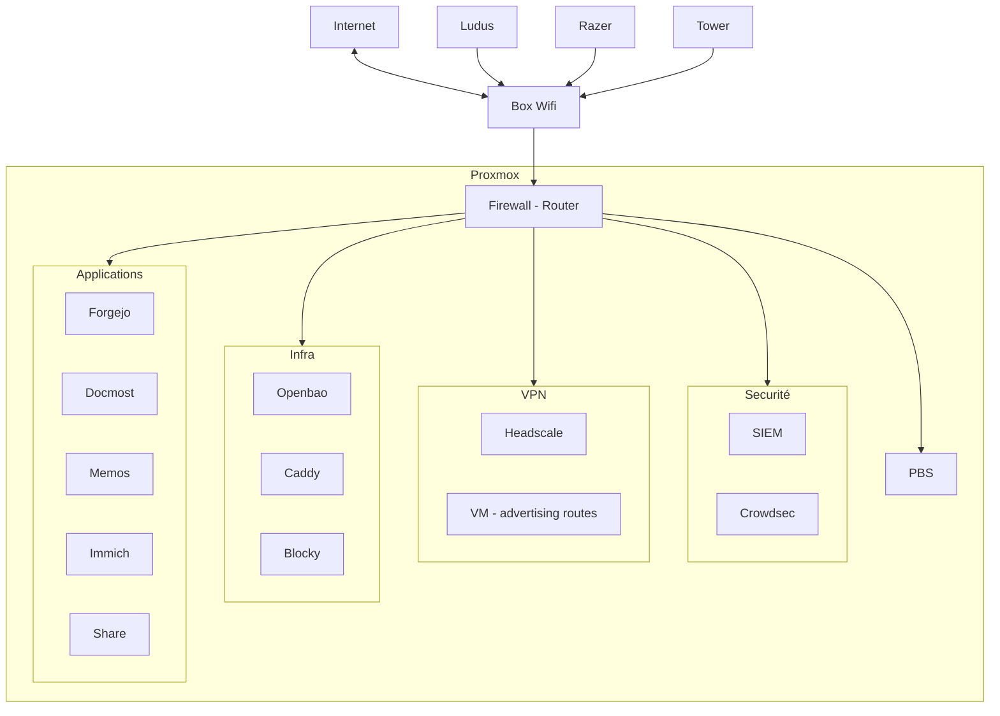

---
sidebar:
  hide: true
---

## Présentation du projet

Dans cette section du site je vais aborder la construction de mon homelab avec les services que j'auto héberge.

L'objectif est de tout gérer avec une approche Devops, donc automatiser la création de l'infra, la récupération des données applicatives depuis un backup ainsi que la destruction de l'infra ou d'une partie de cette dernière. Un point à prendre en compte est que ma machine possède 16Go de RAM et un processeur i5 de 9ième génération, ça implique de faire des concessions sur le nombre de VM que je peux créer et leurs puissances.

J'essaye au maximum d'utiliser des outils et technologies libre et open source, de plus dans cette série à part l'achat de dns je n'utiliserais rien de payant. Cependant l'usage étant non-commercial l'utilisation de certains outils ou technologies pourrais devenir payant dans le cadre d'une utilisation commercial.

### Objectifs
  - Auto-héberger certains services utiles au quotidien notamment :
    - Forgejo pour mon git
    - Momos pour poser des liens ou idées que je relirais plus tard
    - Immich pour stocker mes vidéos
    - Docmost pour ma documentation (ce qui va probablement bientôt)
    - Un share probablement smb pour stocker des fichiers en tout genre
  - Sécuriser mon [système d'information](https://fr.wikipedia.org/wiki/Syst%C3%A8me_d%27information), j'ai un certains nombre de machines, et dans la mesure du raisonable je pense que c'est normal pour un étudiant en cyber sécurité d'appliquer un certains nombre de mesure de sécurité dans sa vie quotidienne, d'autant plus que certains services pourraient être exposés sur internet plus tard.
  - M'améliorer dans plusieurs domaines, tout d'abord la partie devops, qui m'intéresse depuis longtemps (utilisation de [vagrant](https://developer.hashicorp.com/vagrant) pour monter [GOAD](https://orange-cyberdefense.github.io/GOAD/)), par ailleurs j'aime beaucoup l'idée d'[IAC](https://en.wikipedia.org/wiki/Infrastructure_as_code), je pense que cette définition de l'infrastructure la rend plus facile à comprendre au contraire d'infra montée à la main et dont la documentation se fait par voie orale (et dont certains secrets se perdent...) ce qui implique des difficultées d'exploitations et des risques de sécurité. Et enfin l'aspect pratique du devops, la phase de initiale de création du projet peut être longue mais l'évolution de l'infra peut se faire assez rapidement par la suite et sa destruction et création est très rapide également.

Voici un schéma qui présente de manière grossière l'infrastructure que j'essaye de mettre en place pour l'instant :

---

Ce schéma sera amené à être modifié par la suite en fonction des découvertes qui seront faites.

J'ai créer des catégories pour discuter des différentes sections réseau.


  
  
  
  


Dans la suite de cette page je parlerais de la gateway (Firewall - Router sur le schéma) et plus tard de la solution de backup (PBS sur le schéma).

## Gateway

### Objectifs de la gateway

La gateway doit être la porte d'entrée dans le SI, comme tout le traffic réseau va passer par cette gateway elle va devoir :
  - logger tout le traffic
  - faire fonction de firewall
  - faire fonction de router
  - faire fonction d'[IPS](https://www.geeksforgeeks.org/ethical-hacking/intrusion-prevention-system-ips/)

### Technologies étudiés 

#### OPNsense 

> [!NOTE]
> [opnsense](https://opnsense.org/)

J'ai tout d'abord étudié la possibilité d'utiliser OPNsense, cependant son usage par le biais des outils devops m'a semblé très compliqué. Notamment la création du template avec packer pour la configuration initiale des interfaces.

#### NFtable

> [!NOTE]
> [redhat nftable](https://docs.redhat.com/en/documentation/red_hat_enterprise_linux/8/html/configuring_and_managing_networking/getting-started-with-nftables_configuring-and-managing-networking)

L'option que j'ai implémenté au départ était l'utilisation de nftable, en envoyant un template [jinja](https://jinja.palletsprojects.com/en/stable/templates/) nftable sur la gateway, ça permet de gérer simplement la partie firewall et routing.

#### VYos

> [!NOTE]
> [vyos](https://vyos.io/)

Par la suite j'ai entendu parler de VYos, qui semble supporter une approche IAC, cependant les images par défault n'intègre pas qemu-guest-agent et cloud-init, cependant je suis tombé sur [ce repo Forgejo](https://forge.hutit.fr/vyos/vyos-image-builder) qui présente une manière de construire les images vyos qui supporte qemu-guest-agent et cloud-init.

